# Architecture overview — kernel, pack, and the surfaces that drive them

What is actually wired up today, after the **kernel ↔ capability-pack split**
(spec 004) and the **operator frontend** (spec 005). Two composition roots (the CLI
and the frontend) build the same task-agnostic [kernel](../kernel.md) and hand it the
[audit pack](../audit-agent.md). A standalone script drives the PoC-writing experiment
outside the loop.

```mermaid
flowchart TB
    subgraph ROOTS["Composition roots"]
        CLI["sr_agent/cli.py<br/>chat · confirm · relay · memory · audit"]
        FE["frontend/backend/app.py<br/>FastAPI + Svelte operator console"]
    end

    subgraph KERNEL["Kernel — task-agnostic (imports zero packs)"]
        LOOP["orchestrator/loop.py<br/>OrchestratorLoop.run_turn (ReAct)"]
        ACT["orchestrator/action.py<br/>validate_action — OOB gate from action_class"]
        CONF["orchestrator/confirmation.py<br/>out-of-band approval"]
        CTX["orchestrator/context.py<br/>DATA-wrapping every turn"]
        PACKIF["orchestrator/pack.py<br/>CapabilityPack + PackContext"]
        GUARD["guardrails/{sanitize,escalation}<br/>generic triggers"]
        MEM["memory/episodic.py<br/>HMAC append-only, SourceType"]
        LLM["llm_core/{local_client,chat_reasoning,<br/>relay,router,claude_client}"]
        SAND["tools/sandbox.py<br/>--network none ephemeral"]
    end

    subgraph PACK["sr_agent/packs/audit — the audit capability pack"]
        APACK["pack.py → AUDIT_PACK"]
        ADISP["dispatch.py · reasoning.py · escalation.py"]
        APIPE["pipeline.py · planner/ (stage1-3)"]
        ATOOLS["tools/{static_analysis,smartgraphical,<br/>onchain,write_execute}"]
        AMODEL["finding.py (Severity/SIG) · report.py"]
    end

    subgraph EXP["scripts/poc_queue_runner.py — PoC-workability experiment"]
        RUNNER["standalone: model extracts findings →<br/>grounded draft → sandbox compile → fix loop"]
    end

    CLI --> LOOP
    FE --> LOOP
    LOOP --> ACT --> CONF
    LOOP --> CTX
    LOOP --> GUARD
    LOOP --> MEM
    LOOP --> LLM
    LOOP -->|"narrow PackContext"| PACKIF
    APACK -->|"injected into"| PACKIF
    APACK --> ADISP & APIPE & ATOOLS & AMODEL
    ATOOLS -->|"write_execute ⇒ OOB gate"| ACT
    ATOOLS --> SAND
    RUNNER --> LLM
    RUNNER --> SAND
```

## Reading this

- **The kernel is the wired core, not an orphan.** `OrchestratorLoop.run_turn` is
  reached by both composition roots (`sr-agent chat` and the operator frontend). It
  owns the control flow and every invariant; see [chat-turn-flow.md](chat-turn-flow.md)
  for one turn in detail.
- **The boundary is real and tested.** No kernel module imports `sr_agent.packs`
  (architecture test). The audit pack reaches the kernel through the single
  `CapabilityPack` it assembles as `AUDIT_PACK`; the kernel hands pack callables only a
  narrow `PackContext` (never the loop, never a memory-write handle).
- **The OOB confirmation gate is kernel-derived.** `validate_action` requires
  out-of-band approval whenever `action_class == write_execute` (the audit pack's
  `write_poc`/`run_tests`/`deploy_test_contract`). A pack cannot mark such an action
  as skip-confirmation — it has no field for it.
- **`scripts/poc_queue_runner.py` is a standalone experiment**, not the agent: it drives
  `LocalClient` + the sandbox directly to test whether a local model can draft PoCs
  end-to-end. It deliberately bypasses `validate_action` for the low-risk case of
  writing a test file into an external git clone and running `forge test --network none`
  (logged simplification) — a real chat-mode action must not repeat that shortcut.
- **The audited target lives entirely outside this repo** (see
  [audit-agent.md](../audit-agent.md)); the pack reads it at runtime.
