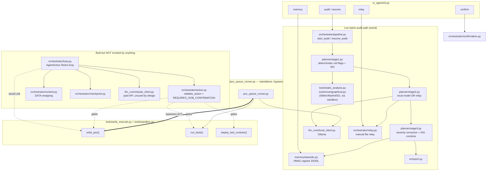

# Architecture overview — what's actually wired up

Two distinct things live in this codebase: (1) the **live batch-audit path**, reachable from the `sr-agent` CLI today, and (2) a **built-but-orphaned agent loop** (`orchestrator/loop.py` + friends) that nothing currently calls. The chat-mode spec (`specs/003-interactive-chat-mode/`) is meant to wire (2) up properly — it isn't built yet.

## Reading this

- **Only the `LIVE` subgraph is reachable from the CLI today.** `sr-agent audit` drives Stage 1 → Stage 2 → Stage 3 → report, using either the local Ollama model or the manual relay bridge, never `orchestrator/loop.py`.
- **`ORPHAN` is real, tested code** (`validate_action`, `REQUIRES_OOB_CONFIRMATION = {write_poc, run_tests, deploy_test_contract}`, DATA-wrapping via `context.wrap_data`) — it's the correctly-gated design for an interactive agent loop. It depends on `llm_core/claude_client.py` (paid Anthropic API), which the project avoids using, and nothing imports `orchestrator/loop.py` — confirmed by `grep`, zero call sites outside its own module.
- **`write_poc`/`run_tests` are registered in `tools/registry.py` as `write_execute` class, requiring out-of-band confirmation** (`_D_WRITE_POC`: *"Requires prior human out-of-band confirmation"*). That gate is enforced by `orchestrator/action.py::validate_action` — but only code paths that call `validate_action` get the gate. Today that's only `orchestrator/loop.py` (orphaned).
- **`scripts/poc_queue_runner.py` calls `write_poc`/`run_tests` directly**, importing them straight from `sr_agent.tools.write_execute` — it never touches `validate_action` or the confirmation flow. This was a deliberate, logged simplification (see the script's module docstring) for a low-risk case: writing test files into a local git clone and running `forge test --network none` in an ephemeral container, not touching funds or a live network. It is not what the registered tool description promises, and a real chat-mode implementation must not repeat this shortcut for anything the registry marks `write_execute`.
