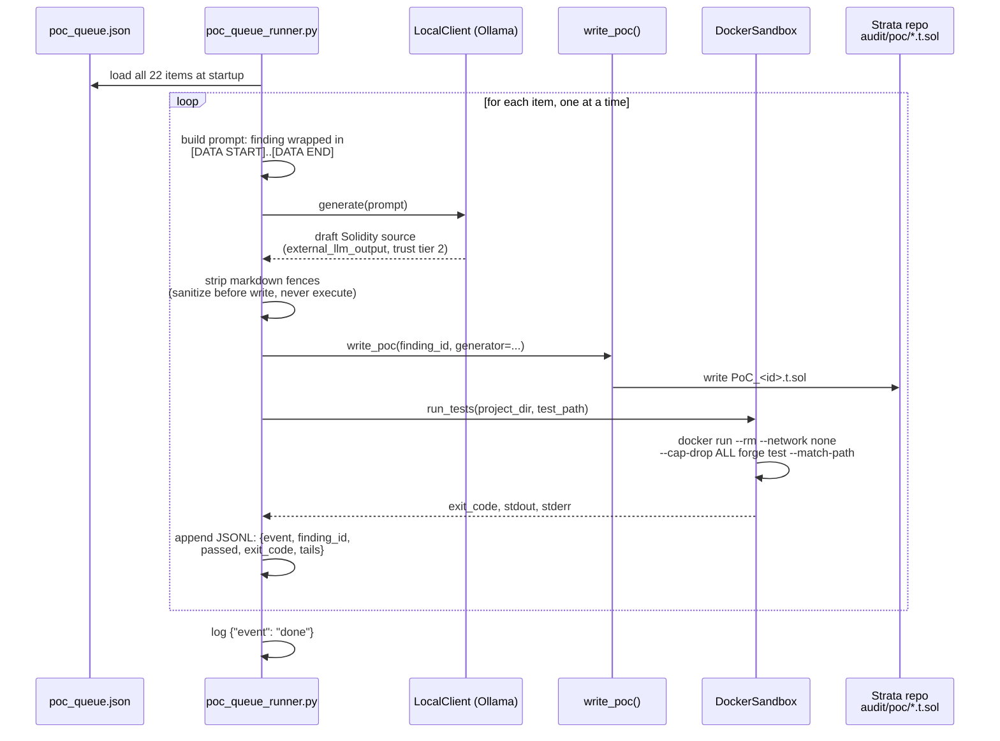

# PoC-writing flow — current execution (scripts/poc_queue_runner.py)

This is the mechanism running in the background right now, writing PoCs for the Strata bug-bounty findings/leads. It is **not** the chat-mode orchestrator from `specs/003-interactive-chat-mode/` — that isn't built yet. It's a standalone script that sequentially drives two existing tool modules (`llm_core/local_client.py`, `tools/write_execute.py` + `tools/sandbox.py`), reading a fixed queue and writing one PoC at a time.

## What's real here vs. what's simplified

- **Real, matches the project's trust model**: the finding description is embedded as `[DATA START]..[DATA END]` in the prompt — the prompt text itself instructs the local model not to follow imperative text inside that block. The runner's control flow is fixed Python, not driven by the model's output; the model only ever produces a Solidity string that gets sanitized (fence-stripped) and written to disk.
- **Real**: `run_tests` executes only inside `DockerSandbox` — `--network none`, `--cap-drop ALL`, ephemeral container, matches the sandbox contract used everywhere else in the project (Slither/Mythril runs use the same primitive).
- **Simplified, on purpose, logged in the script's docstring**: no out-of-band `sr-agent confirm` gate per item, and `validate_action`/`REQUIRES_OOB_CONFIRMATION` are bypassed entirely — see [architecture-overview.md](architecture-overview.md) for why this specific script gets away with it (low blast radius: local git clone, sandboxed, no funds, no live network) and why that exception must **not** be copied into the real chat-mode implementation.
- **Not present at all**: no memory-record writing, no finding-status changes, no escalation triggers — the runner only writes test files and appends to its own progress log. It cannot mark anything `verified_safe` or otherwise touch episodic memory, so even a fully adversarial local-model output has nowhere to escalate to.
- **Sequential by design**: one item at a time, not parallel — a stuck/slow local-model call or a hung `forge test` blocks the next item rather than corrupting shared state, at the cost of total wall-clock time for the full queue.
