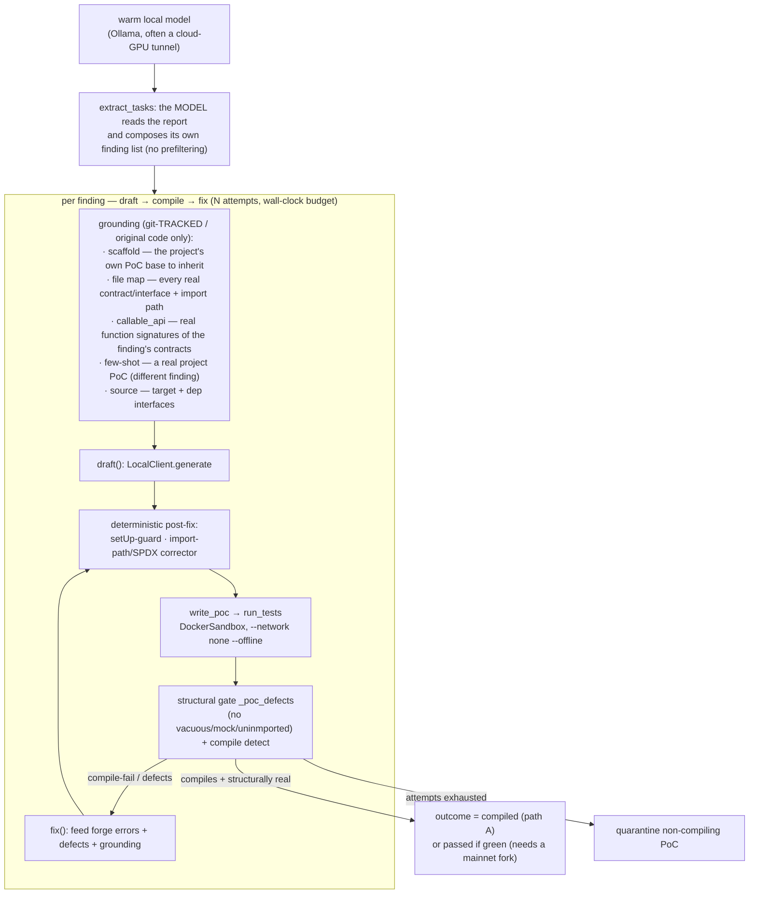

# PoC-writing flow — `scripts/poc_queue_runner.py`

The **PoC-workability experiment**: can a local model, driven by good honest
grounding, autonomously write proof-of-code for *every* finding in an external audit
report — composing its own task list (detection) and drafting/repairing the PoCs
itself? A standalone script (not the chat orchestrator) that talks to a local model
over Ollama and runs each PoC in the network-isolated sandbox.

The target — its contracts, report, and generated PoCs — lives **entirely outside this
repo** (`POC_PROJECT` / `POC_REPORT`); nothing target-specific is committed here.

## Reading this

- **The model does the work end-to-end** — it extracts the finding list itself
  (detection) and drafts + repairs each PoC. The operator only runs the harness and
  provides the target path; findings/PoCs are never hand-authored here.
- **Grounding is honest** — only the target's own **git-tracked (original)** code is
  fed in; skill-generated PoCs are excluded so the model is never handed an answer.
  The file map + callable_api counter the model's habit of inventing interface names /
  method signatures; the scaffold lets it inherit the project's real deploy base.
- **Deterministic guards beat prompting for mechanical errors** — a small model keeps
  overriding a non-virtual `setUp` (4334) or emitting a bad import depth / a bare SPDX
  line; those are fixed in code after generation, not left to the prompt.
- **The success bar is honest about the sandbox** — this target's PoCs are mainnet-fork
  tests, which can't run green under `--network none`; so path A counts a PoC that
  **compiles and is structurally real** ("compiled"), and only a green `forge` run is
  "passed" (`--require-pass`). A pass with a vacuous/mocked test is rejected by the gate.

See [../audit-agent.md](../audit-agent.md) for how PoC drafting relates to the audit
pack, and [../research/cloud-gpu-hosting.md](../research/cloud-gpu-hosting.md) for
hosting the local model on a metered cloud GPU.
